# 计算机系统
研究“hello，world”程序的生命周期，介绍计算机系统的主要概念和主题

## 1.1 信息就是位+上下文
8个位（二进制）称为一个字节

## 1.2 程序被其他程序翻译成不同的格式
GCC编译过程
```bash
gcc -o hello hello.c
```
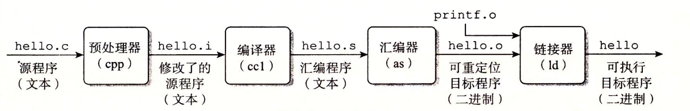
* **预处理**，cpp根据以字符`#`开头的命令，修改原始的C程序。`#include <stdio.h>`，预处理器读取系统头文件`stdio.h`并将它降入程序文本。最后得到另一个C程序，以`-i`作为文件扩展名
* **编译**，cc1将文本文件`-i`翻译成文本文件`hello.s`，这是一个汇编语言程序（也是一个文本文件）
```asm
main:
    subq $8, %rsp
    movl $.LC0, %edi
    call puts
    movl $0, %eax
    addq $8, %rsp
    ret
```
* **汇编**，将`.c`文件翻译成机器语言指令，并打包成一个可重定位目标程序（relocatable object program），并将结果把将结果保存在目标文件`.o`（包含函数main的指令编码）。
* **链接**，将已经编译好的目标文件连接起来（把头文件,类似于python中的库，和这个程序进行链接，头文件以单独的预编译好的目标文件，或者是自己写的，生成`.o`文件之后再进行连接）

## 1.3 为什么要了解编译系统
* **优化程序性能** 
* **理解链接时出现的错误**
* **避免安全漏洞**

## 1.4 处理器并解释存储在内存中的指令
```bash
linux> ./hello
hello, world
```
如果shell中的第一个单词不是一个内置的shell命令，那么shell会假设这是一个可执行文件
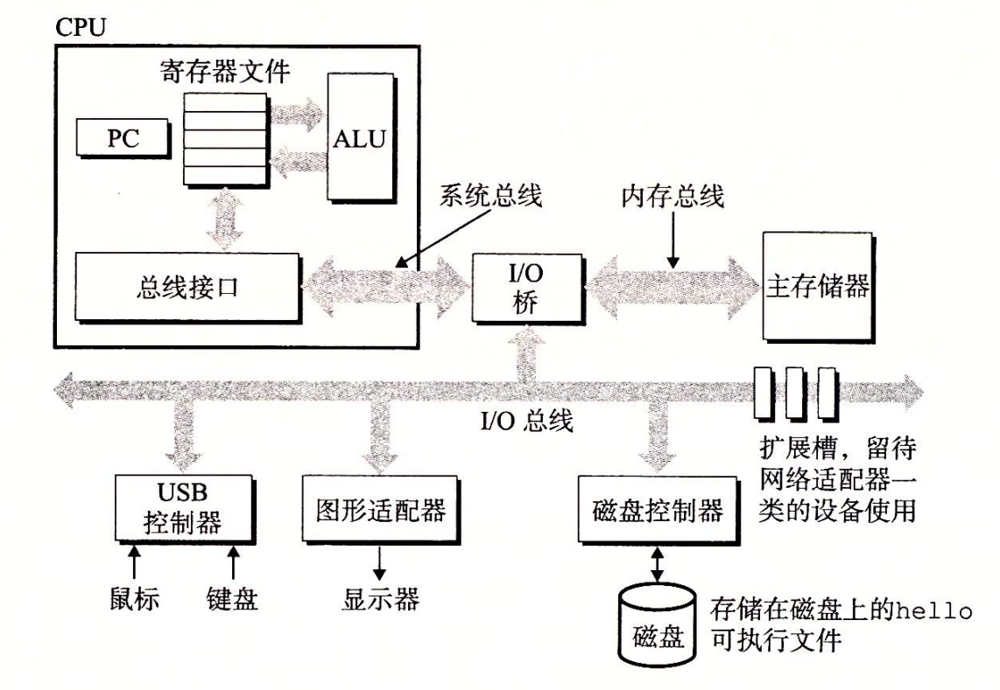
### 1.4.1 系统的硬件构成

1. **总线**，携带信息字节并负责在各个部件间传递。被设计成传送定长的字节块（word）。字中的字节数（字长）是一个基本的系统参数，一般是4个字节（32位），8个字节（64）位。

2. **I/O设备**，输入设备/输出设备，存储数据和程序的磁盘驱动器。每个I/O设备都通过一个**控制器**或**适配器**与I/O总线相连。控制器是 I/O 设备本身或者系统的主印制电路板（通常称作主板）上的芯片组。而适配器则是一块插在主板插槽上的卡。
3. **主存**， 处理器执行程序时，用来存放程序和程序处理的数据。由**动态随机存取存储器（DRAM）**芯片组成（线性的字节数组），每个字节都有唯一的地址（数组索引）。
4. **处理器**，CPU是解释存储在主存中指令的引擎。处理器的核心是一个大小为一个字节的存储设备（**寄存器**），称为**程序计数器**（PC）。PC永远指向主存中的某条机器语言指令（即含有该条指令的地址）

处理器执行程序计数器指向的指令，再更新程序计数器，使其指向下一条指令。严格按照的顺序执行。处理器从程序计数器指向的内存中读取指令，解释指令中的位，执行操作，然后更新PC，使其指向下一条指令。

寄存器存储指令地址，ALU计算新的数据和地址值。

例
* **加载** 从主存中复制一个字节或字到寄存器，覆盖原有的内容
* **存储** 从寄存器中复制一个字节或者一个字到主存中的某个位置，覆盖这个位置原有的内容
* **操作** 把两个寄存器的内容复制到ALU，ALU对这两个字做算术运算，并将结果存放到一个寄存器，覆盖原有的内容。
* **跳转** 从指令本身中抽取一个字，并将这个字复制到程序计数器PC中，覆盖PC中原有的值

**指令集架构**，描述每条机器代码指令的效果
**微体系结构**，描述的处理器是如何实现的

shell中输入字符串`./hello`之后，shell程序将字符逐一读入寄存器，再把它放到内存中。
之后shell执行指令来加载可执行hello文件，将hello目标文件中的代码和数据从磁盘复制到主存。
一旦hello中的代码和数据被加载到主存，处理器就开始执行main程序中的机器语言指令。
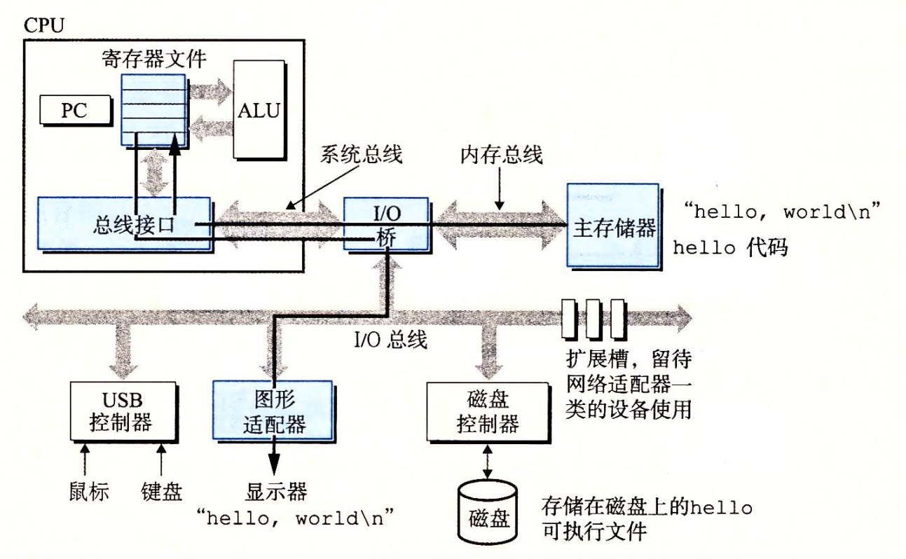

## 1.5 高速缓存
相较于主存更快更小的存储设备**高速缓存存储器**（cache）。L1可达数万字节，访问速度几乎和寄存器一样快。L2通过一条特殊的总线连接到处理器。访问L2的时间要比访问L1的时间长5倍。
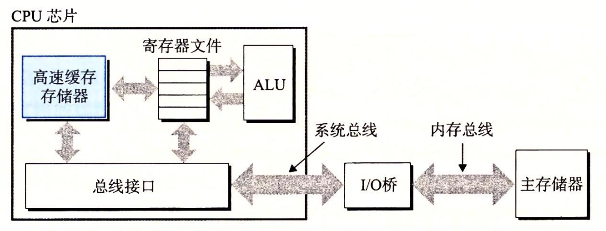

## 1.6 存储设备层次结构
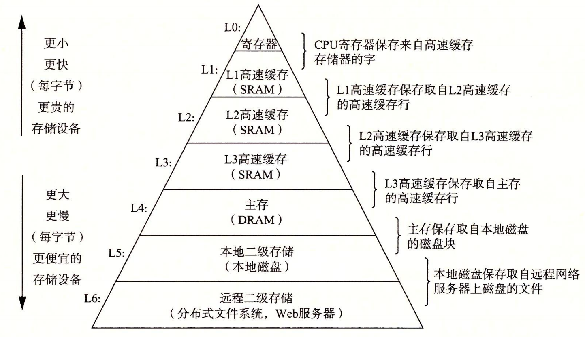

## 1.7操作系统管理硬件
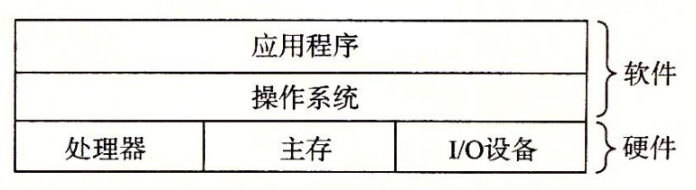
所有应用程序对硬件的操作尝试都必须通过操作系统。
1. 防止硬件被失控的应用程序滥用
2. 向应用程序提供简单一致的机制来控制复杂而又通常大不相同的低级硬件设备
通过几个基本的抽象概念（**进程**、**虚拟内存**和**文件**）来实现这两个功能
文件是对 I/O 设备的抽象表示，虚拟内存是对主存和磁盘 I/O 设备的抽象表示，进程则是对处理器、主存和 I/O 设备的抽象表示

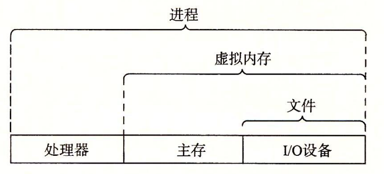

### 1.7.1 进程

**进程**是对正在运行的程序的一种抽象。操作系统可以并发运行多个进程，通过**上下文切换**来使处理器再进程间切换。

**上下文**操作系统跟踪进程运行所需的所有状态信息。

运行hello程序时，shell通过调用一个专门的函数，来执行请求，系统会将控制权传递给操作系统。操作系统保存shell的上下文，创建一个新的hello进程及其上下文，然后将控制权传给新的hello进程。hello进程终止后，操作系统恢复shell的上下文，并将控制权传给shell。

进程间的转化由**kernel**管理。kernel是系统代码常驻主存的部分。当应用程序需要操作系统的某些操作时，比如读写文件，它就执行一条特殊的系统调用（system call）指令，将控制权传递给内核。然后内核执行被请求的操作并返回应用程序。
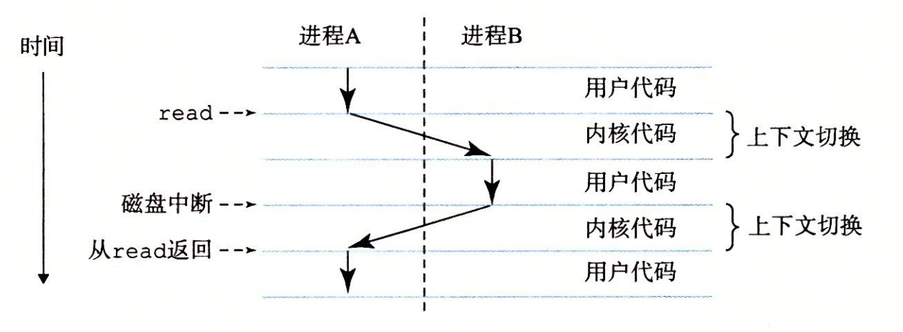

kernel是系统管理全部进程所用代码和数据结构的集合。

### 1.7.2 线程
一个进程实际上可以由多个称为线程的执行单元组成，每个线程都运行在进程的上下文中，并共享同样的代码和全局数据。

### 1.7.2 虚拟内存
虚拟内存是一个抽象概念，它为每个进程提供了一个假象，即每个进程都在独占地使用主存。每个进程看到的内存都是一致的，称为虚拟地址空间。地址是从下往上增大。（内核空间共享给所有的用户进程，所有进程的虚拟地址空间的内核部分通常映射到相同的物理内存区域）
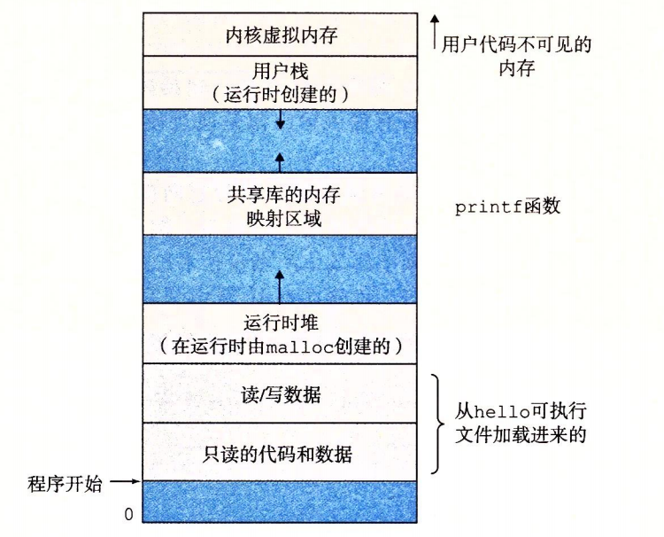


1. **程序代码和数据**。对所有的进程来说，代码是从同一固定地址开始，紧接着的是和 C 全局变量相对应的数据位置。代码和数据区是直接按照可执行目标文件的内容初始化的，在示例中就是可执行文件 hello。在第 7 章我们研究链接和加载时，你会学习更多有关地址空间的内容。

2. **堆**。代码和数据区后紧随着的是运行时堆。代码和数据区在进程一开始运行时就被指定了大小，与此不同，当调用像 malloc 和 free 这样的 C 标准库函数时，堆可以在运行时动态地扩展和收缩。在第 9 章学习管理虚拟内存时，我们将更详细地研究堆。 

3. **共享库**。大约在地址空间的中间部分是一块用来存放像 C 标准库和数学库这样的共享库的代码和数据的区域。共享库的概念非常强大，也相当难懂。在第 7 章介绍动态链接时，将学习共享库是如何工作的。 

4. **栈**。位于用户虚拟地址空间顶部的是用户栈，编译器用它来实现函数调用。和堆一样，用户栈在程序执行期间可以动态地扩展和收缩。特别地，每次我们调用一个函数时，栈就会增长；从一个函数返回时，栈就会收缩。在第 3 章中将学习编译器是如何使用栈的。

5. **内核虚拟内存**。地址空间顶部的区域是为内核保留的。不允许应用程序读写这个区域的内容或者直接调用内核代码定义的函数。相反，它们必须调用内核来执行这些操作。

### 1.7.4 文件
文件就是字节序列。每个I/O设备，包括磁盘、键盘、显示器，甚至网络，都可以看成是文件。

## 1.9重要主题
### 1.9.2 并发和并行
1. 线程级并发
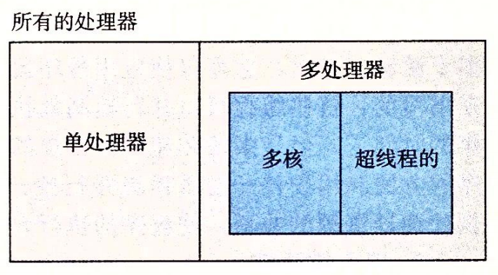
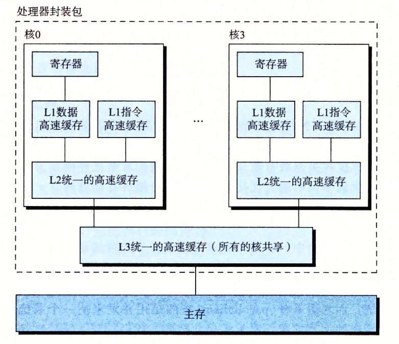
**同时多线程（超线程）**允许CPU执行多个控制流的技术。CPU的某些硬件有多个备份（例如程序计数器，寄存器），而其它硬件只有一份(例如浮点运算单元)。超线程的处理器可以在单个周期的基础上决定要执行哪一个线程，无需进行不多进行间的转换。

2. 指令级并行
3. 单指令，多数据并行
允许一条指令产生多个可以并行执行的操作，这种方式称为单指令、多数据，即 SIMD 并行。