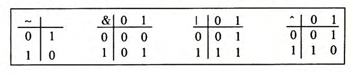

# 信息的表示和处理

二值信号（位bit）。负数表示，实数近似值的编码。

三种重要的数字表示，**无符号**表示大于或等于零的数字，**补码**表示有符号整数，**浮点数**表示实数的科学计数法的以2为基数的版本。

计算机用有限数量的位来对一个数字编码。结果太大而不能表示时，运算就会**溢出**（overflow）。整数运算满足整数运算的性质，但可能不会产生期望的结果。浮点数运算是不可结合的。整数是精确的。浮点数是近似的。
## 2.1信息的存储
**字节**（byte）是最小的可寻址的内存。机器级程序将内存视为一个非常大的字节数组，成为**虚拟内存**。内存的每一个字节都由一个唯一的数字来标识，称为它的**地址**，所有可能的地址的集合成为**虚拟地址空间**。

### 2.1.1 十六进制表示法
以0x或0X开头的数字常量是十六进制的值（0x表示这是16进制）。二进制四位数字可以依次转换成16进制。十六进制转十进制，可以先记住A，C，F相应的十进制。B，D，E通过计算其与A，C，F的相对关系来进行转换。

例，16进制数字0x173A4C转换

所以二进制表示是000101110011101001001100
2进制数字1111001010110110110011转16进制


### 2.1.2 字数据大小
每台计算机都有一个字长（word size），指明指针数据的标称大小（nominal size）。虚拟地址是以一个字来编码。子长决定虚拟地址空间的最大大小。字长为$w$位的机器，虚拟地址的范围为$0 \sim 2^w-1$，程序最多访问$2^w$个字节。
32位字长限制虚拟地址空间为4千兆（4GB），64位字长虚拟地址空间为16EB
64位机器也可以运行32位机器编译的程序
```bash
linux> gcc -m32 prog.c
```
程序可以在32或64位机器上运行
```bash
linux> gcc -m64 prog.c
```
程序只能在64位机器上运行


这里char *使用程序的全字长。float指单精度，double指双精度。


### 2.1.3 寻址和字节顺序
多字节对象的地址为所使用字节中最小的地址。int变量x的地址为0x100.地址表达式&x的值为0x100。那么x的4个字节将被存储在内存的0x100，0x101，0x102，0x103位置

按照从最高有效字节到最低有效字节的顺序存储称为**大端法**。
最低有效字节在最前面称为**小端法**。
16进制0x01234567

```bash
4004d3: 01 05 43 0b 20 00 add %eax, 0x200b43(%rip)
```
一般计算机使用小端法来存储字节，书写使用大端。
C 中可以使用强制类型转换或者联合来允许一种数据类型引用一个对象，这种数据类型与创建这个对象是定义的数据类型不同。

```c
#include <stdio.h>

typedef unsigned char *byte_pointer;

void show_bytes(byte_pointer start, size_t len){
    size_t i;
    for (i=0; i<len; i++){
        printf("%.2x", start[i]);
    }
    printf("\n");
}

void show_int(int x){
    show_bytes((byte_pointer) &x, sizeof(int));
}

void show_float(float x){
    show_bytes((byte_pointer) &x, sizeof(float));
}

void show_pointer(void *x){
    show_bytes((byte_pointer) &x, sizeof(void *));
}
```
在这个程序中指针被强制类型转换为“unsigned-char”。

printf函数打印信息。第一个参数是格式串，其余是要打印的值。格式串中以“%”开头的字符序列表示如何格式化下一个参数。‘%d’输出一个十进制整数，‘%f’输出一个浮点数，‘%c’输出一个字符。

浮点和整型都对12345编码，但字节模式不同
整型：0x00003039
浮点型：0x4640E400
将十六进制转换为二进制，他们会有13个相匹配的位的序列

二进制代码不是兼容的，不能再不同机器和操作系统组合之间移植

### 2.1.6 布尔代数

`~`运算对应于NOT，`&`对应于AND，`|`对应于或，`^`对应于异或
可以将布尔运算扩展到**位向量**的运算，即对应位分别进行布尔运算。
布尔代数满足`&`对`|`的分配律，写作`a&(b|c)=(a&b)|(a&c)`。此外`|`对`&`也满足分配律`a|(b&c)=(a|b)&(a|c)`
用位向量$[a_{w-1},..,a_1,a_0]$编码子集$A\subset{0, 1, ..., w-1}$，其中$a_i=1$当且仅当$i \in A$。这样布尔运算`|`表示集合的并，`&`交，`~`表示集合的补

### 2.1.7 C语言中的位级运算
C语言可以将布尔运算运用到“整型”数据上
位运算可以用于实现**掩码**。掩码是一个位模式，表示从一个字中选出的位的集合。0xFF(最低的8位为1)表示一个字的低位字节。x&0xFF生成一个由x的最低有效字节组成的值。其他的字节就被设置为0。x=0x89ABCDEF，那么x&0xFF得到0x000000EF。表达式`~0`会生成一个全是1的掩码，不管机器的字的大熊啊是多少。

### 2.1.8 C语言中的逻辑运算
逻辑运算认为所有非零参数都表示为TRUE，参数0表示为FALSE。


### 2.1.9 C语言中的移位运算
一个位表示为$[x_{w-1},x_{w-2},...,x_0]$的数$x$，C表达式$x << k$ 会生成$[x_{w-k-1},x_{w-k-2},...,x_0,0,...,0]$。x向左移动k位，对齐最高的k位，并在右端补k个0.右移运算$x >> k$，逻辑右移和算术右移。逻辑右移直接补0，算数右移会补最高有效位的值。对于有符号数进行算数右移，无符号数进行逻辑右移。